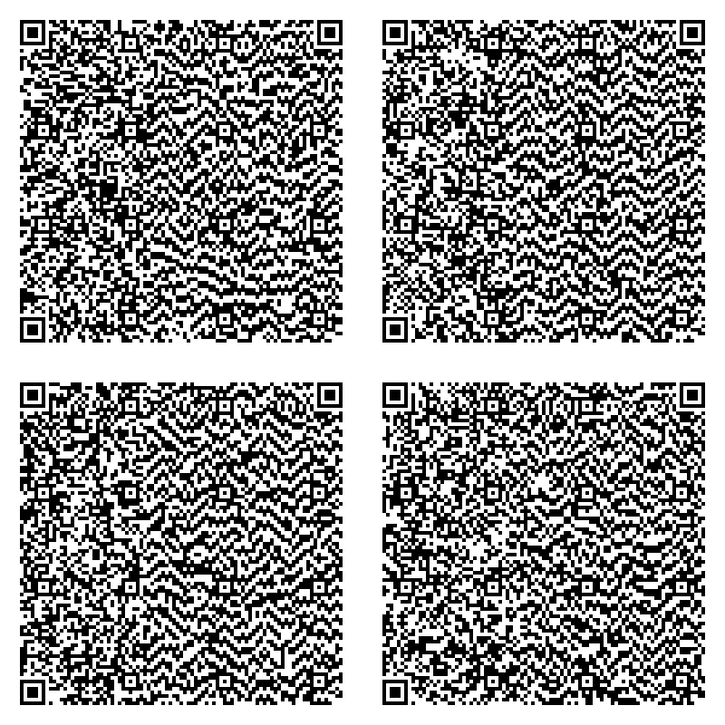

# ACNH-Pattern-Research
Research on Animal Crossing: New Horizons design pattern data.

I noticed when using [NHSE](https://github.com/kwsch/NHSE) and different design editors that under certain conditions, importing pattern files (`.nhd` or `.acnh`) did not seem to set the patterns as owned by the player and thus they were not editable in-game, much like if they were QR codes or from the pattern exchange.  
I also noticed that for some pattern slots, the previous pattern name would remain in place of the imported one and both issues bugged me.

So, [I forked NHSE](https://github.com/lottehime/NHSE), grabbed some dumped patterns and dat files then spent some time and hacked together a fix and added it to my fork, which was successfully merged into the main repo (yay!🥳)... and I will continue to submit finds and fun features to NHSE as it is the best thing out there for goofing with ACNH! 🏝️🤓

Some details are common enough knowledge that they are incorporated into code bases, some aren't (such as the fix), but there doesn't seem to be a consolidated spot for the information.  
As a result of looking into it, I was also motivated to document the details and to create some tools to rip, host, convert and catalog design pattern files.

You can find technical detail in the below writeup and/or check out my [ACNH Pattern Dump Index](https://github.com/lottehime/ACNH-Pattern-Dump-Index) repo (WIP!👷).

---

<!-- BUY ME A COFFEE -->
### Help Support More Like This

If any of this has been helpful, please consider caffeinating me further ☕  
Thanks!

---

# Research

### Table of Contents:
<!-- TABLE OF CONTENTS -->
<ol>
    <li><a href="#acnh-general-design-pattern-info">ACNH General Design Pattern Info</a></li>
    <ul>
    	<li><a href="#acnh-design-pattern-fix-conclusion">ACNH Design Pattern Fix Conclusion</a></li>
	</ul>
    <li><a href="#acnh-design-pattern-data">ACNH Design Pattern Data</a></li>
    <ul>
    	<li><a href="#acnh-pro-design-pattern-exception">ACNH PRO Design Pattern Exception</a></li>
        <li><a href="#acnh-pattern-data-visual">ACNH Pattern Data Visual</a></li>
    	<li><a href="#acnh-pattern-type-values">ACNH Pattern Type Values</a></li>
	</ul>
    <li><a href="#acnl-interoperability">ACNL Interoperability</a></li>
    <ul>
    	<li><a href="#acnl-pattern-data">ACNL Pattern Data</a></li>
    	<li><a href="#acnl-pattern-types-values">ACNL Pattern Types Values</a></li>
    	<li><a href="#acnl-color-palette-index">ACNL Color Palette Index</a></li>
    	<li><a href="#acnl-palette-common-representation">ACNL Palette Common Representation</a></li>
    	<li><a href="#acnl-pattern-conversion-pseudocode">ACNL Pattern Conversion Pseudocode</a></li>
	</ul>
    <li><a href="#qr-code-data-information">QR Code Data Information</a></li>
    <ul>
    	<li><a href="#normal-design-pattern-qr-codes">Normal Design Pattern QR Codes</a></li>
    	<li><a href="#pro-design-pattern-qr-codes">PRO Design Pattern QR Codes</a></li>
	</ul>
</ol>

(<a href="#readme-top">back to top</a>)

## ACNH General Design Pattern Info

Design pattern data is found in `main.dat` within the save, as are flags for if the player has edited the pattern slot.  
An ID for the player and the town/island reside in `personal.dat` within the save.

The pattern 'IsEdited' flags begin at offset `0x8BE260` starting with design 1 of 100. Each flag is a single byte and each byte begins as `0xFF` and is changed to `0x00` when the player edits that pattern slot.  
Add `0x64` to that offset to get to the design PRO patterns at offset `0x8BE2C4` starting with design 1 of 100. The bytes follow the same pattern as above.  
This fixes the issue of imported patterns retaining the name of the pattern originally in that slot.

The issue of pattern ownership and editability is caused by the pattern data not being written to `main.dat` with the players IDs correctly, as well as what appears to be a flag value that needs to be reset.  
The players ID information can be found within `personal.dat` starting at offset `0xB0B8`. It can also be found in other locations, such as `main.dat` before the pattern offsets.  
It is made up of two primary parts: the `PlayerID` and `TownID`, which are each made up of two parts; the `ID` and the `Name`.

The TownID comes first, with the ID starting at offset `0xB0B8` for 4 bytes, followed by the name starting at `0xB0BC` for 20 bytes.  
The 20 bytes represent the name as a 10 character long name with `0x00` between each character.

The PlayerID comes next, with the ID starting at offset `0xB0D4` for 4 bytes, followed by the name starting at `0xB0D8` for 20 bytes.  
The 20 bytes represent the name as a 10 character long name with `0x00` between each character.

Storing these as a two byte arrays of `0x18` or 24 bytes length starting at each of their respective offsets allows us to then write them into the data for the patterns as we insert them into `main.dat`.

The flag value that follows them appears to be 4 bytes long and replacing each byte with `0x00` seems to modify ownership so long as the above ID values match what the game expects correctly.

Patterns in `main.dat` start at offset `0x1E3968` and flow into one another.  
Complete untrimmed pattern data is 680 bytes long, starting with a 16 byte hash and ending with 3 trailing `0x00` bytes after the image data.  
This format matches what you will find in `*.acnh` files from https://acpatterns.com/ and `*.nhd` files from NHSE, files from other editors may be trimmed.  
We can use a `*.nhd` file to isolate the data we are interested in.

(<a href="#readme-top">back to top</a>)

### ACNH Design Pattern Fix Conclusion

If we take the `PlayerID` and `TownID` data extracted from `personal.dat` and inject it at offsets `0x54` and `0x38` respectively, then write these back to their correct location in `main.dat` (main pattern offset + index) we end up with a pattern written with the image we wanted, and the correct player and town IDs. Then we can overwrite the data at `0x70` with `0x00, 0x00, 0x00, 0x00`. This allows the user to own/edit them in-game.

When you mix the pattern being updated with the players IDs correctly, and the IsEdited flags flipped to edited you get a correctly named and editable pattern imported into your save. Yay!

PRO patterns follows a similar methodology, but with differing offsets. The above concept applied to them also works.  
You can refer to the below for more info.

This was fun to find and fix and I hope it is an educational reference in the future.

The structure of the design pattern file/data is explained below: 

(<a href="#readme-top">back to top</a>)

### ACNH Design Pattern Data

|  Offset & Range  | Data Purpose                                                         | Data Type     |
|      :---:       | :---                                                                 | :---          |
| `0x000 -> 0x00F` | pattern hash - (16 bytes long)                                       | UInt16/UInt32 |
| `0x010 -> 0x037` | pattern name - (40 bytes long, 20 char name with separating `0x00`)  | ASCII/UTF-8   |
| `0x038 -> 0x03B` | town ID - (4 bytes long)                                             | UInt16/UInt32 |
| `0x03C -> 0x04F` | town name - (20 bytes long, 10 char name with separating `0x00`)     | ASCII/UTF-8   |
| `0x050 -> 0x053` | padding? - (4 bytes long)                                            | Byte          |
| `0x054 -> 0x057` | player ID - (4 bytes long)                                           | UInt16/UInt32 |
| `0x058 -> 0x06B` | player name - (20 bytes long, 10 char name with separating `0x00`)   | ASCII/UTF-8   |
| `0x06C -> 0x06F` | padding? - (4 bytes long)                                            | Byte          |
| `0x070 -> 0x073` | ownership flag? - (4 bytes long)                                     | Byte          |
| `0x074 -> 0x076` | padding? - (3 bytes long)                                            | Byte          |
| `0x077 -> 0x077` | pattern type - (1 byte long, see below)                              | Byte          |
| `0x078 -> 0x0A4` | palette data - (45 bytes long, 15*3, 15 colors 3 bytes each (rgb))   | UInt8         |
| `0x0A5 -> 0x2A4` | pixel data - (512 bytes long, pro designs except this, see below)    | UInt8         |
| `0x2A5 -> 0x2A7` | trailing padding - (3 bytes long)                                    | Byte          |

(<a href="#readme-top">back to top</a>)

### ACNH PRO Design Pattern Exception

For PRO Design Patterns, the pixel data is longer and is followed by the same termination padding.  
See below:  

|  Offset & Range  | Data Purpose                       | Data Type |
|      :---:       | :---                               | :---      |
| `0x0A5 -> 0x8A4` | pixel data - (2048 bytes long)     | UInt8     |
| `0x8A5 -> 0x8A7` | trailing padding - (3 bytes long)  | Byte      |

(<a href="#readme-top">back to top</a>)

### ACNH Pattern Data Visual

Below is a visualisation of the example `.nhd` included in the repo, with each data section highlighted:

Due to the QR code import in ACNH that supports ACNL designs, interoperability is supported and fairly straight forward.  
See below for more information:

(<a href="#readme-top">back to top</a>)

### ACNH Pattern Type Values

| Index Value | Type Indicator                         | Data Type | ACNL Equiv.      |
|    :---:    | :---                                   | :---      | :---             |
| `0x00`      | Simple Pattern                         | Byte      | ✔️ `0x09`        |
| `0x01`      | Empty Pro Pattern                      | Byte      | ❌ Not supported |
| `0x02`      | Simple Shirt                           | Byte      | ❌ Not supported |
| `0x03`      | Long Sleeve Shirt                      | Byte      | ❌ Not supported |
| `0x04`      | T Shirt                                | Byte      | ❌ Not supported |
| `0x05`      | Tanktop                                | Byte      | ❌ Not supported |
| `0x06`      | Pullover                               | Byte      | ❌ Not supported |
| `0x07`      | Hoodie                                 | Byte      | ❌ Not supported |
| `0x08`      | Coat                                   | Byte      | ❌ Not supported |
| `0x09`      | Short Sleeve Dress                     | Byte      | ❌ Not supported |
| `0x0A`      | Sleeveless Dress                       | Byte      | ❌ Not supported |
| `0x0B`      | Long Sleeve Dress                      | Byte      | ❌ Not supported |
| `0x0C`      | Balloon Dress                          | Byte      | ❌ Not supported |
| `0x0D`      | Round Dress                            | Byte      | ❌ Not supported |
| `0x0E`      | Robe                                   | Byte      | ❌ Not supported |
| `0x0F`      | Brimmed Cap                            | Byte      | ❌ Not supported |
| `0x10`      | Knit Cap                               | Byte      | ❌ Not supported |
| `0x11`      | Brimmed Hat                            | Byte      | ❌ Not supported |
| `0x12`      | Short Sleeve Dress 3DS                 | Byte      | ✔️ `0x01`        |
| `0x13`      | Long Sleeve Dress 3DS                  | Byte      | ✔️ `0x00`        |
| `0x14`      | Sleeveless Dress 3DS                   | Byte      | ✔️ `0x02`        |
| `0x15`      | Short Sleeve Shirt 3DS                 | Byte      | ✔️ `0x04`        |
| `0x16`      | Long Sleeve Shirt 3DS                  | Byte      | ✔️ `0x03`        |
| `0x17`      | Sleeveless Shirt 3DS                   | Byte      | ✔️ `0x05`        |
| `0x18`      | Hat 3DS                                | Byte      | ✔️ `0x07`        |
| `0x19`      | Horn Hat 3DS                           | Byte      | ✔️ `0x06`        |
| `0x1E`      | Standee 3DS                            | Byte      | ✔️ `0x08`        |
| `0x1A`      | Standee                                | Byte      | ❌ Not supported |
| `0x1B`      | Umbrella                               | Byte      | ❌ Not supported |
| `0x1C`      | Flag                                   | Byte      | ❌ Not supported |
| `0x1D`      | Fan                                    | Byte      | ❌ Not supported |
| `0xFF`      | Unsupported                            | Byte      | N/A              |

(<a href="#readme-top">back to top</a>)

## ACNL Interoperability

Due to the QR code import in ACNH that supports ACNL designs, interoperability is fairly straight forward.  
The ACNL design pattern data format shares similarities with the ACNH format in that it contains name strings, ID bytes, hashes, pattern type bytes, a color palette and pixel data.

To convert the data between, you simply need to adjust values as required and move the data to the correct offsets.  
The structure is per below:

(<a href="#readme-top">back to top</a>)

### ACNL Pattern Data

|  Offset & Range  | Data Purpose                                                                | Data Type     |
|      :---:       | :---                                                                        | :---          |
| `0x000 -> 0x027` | pattern name (40 bytes long, 20 char name with separating `0x00`)           | ASCII/UTF-8   |
| `0x028 -> 0x029` | padding (2 bytes long)                                                      | Byte          |
| `0x02A -> 0x02B` | player ID (2 bytes long)                                                    | UInt16/UInt32 |
| `0x02C -> 0x03D` | player name (18 bytes long, 9 char name with separating `0x00`)             | ASCII/UTF-8   |
| `0x03E -> 0x03F` | padding (2 bytes long)                                                      | Byte          |
| `0x040 -> 0x041` | town id (2 bytes long)                                                      | UInt16/UInt32 |
| `0x042 -> 0x053` | town name (18 bytes long, 9 char name with separating `0x00`)               | ASCII/UTF-8   |
| `0x054 -> 0x057` | unknown flag/hash? (4 bytes long, values seem random, change has no effect) | Byte          |
| `0x058 -> 0x066` | palette data (15 bytes long, value is an index lookup, see below)           | Byte          |
| `0x067 -> 0x067` | unknown flag? (1 byte long, value seems random, change has no effect)       | UInt8?        |
| `0x068 -> 0x068` | ownership flag? (1 byte long, appears to be `0x00` or `0x0A` only)          | UInt8?        |
| `0x069 -> 0x069` | pattern type (1 byte long, see below)                                       | Byte          |
| `0x06A -> 0x06B` | unknown (2 bytes long, value seems random, change has no effect)            | Byte          |
| `0x06C -> 0x26B` | pixel data main (512 bytes long, main pixels)                               | UInt8         |
| `0x26C -> 0x46B` | pixel data expanded 1 (512 bytes long, extra pro pattern pixels)            | UInt8         |
| `0x46C -> 0x66B` | pixel data expanded 2 (512 bytes long, extra pro pattern pixels)            | UInt8         |
| `0x66C -> 0x86B` | pixel data expanded 3 (512 bytes long, extra pro pattern pixels)            | UInt8         |
| `0x86C -> 0x86F` | trailing padding (4 bytes long, appears optional)                           | Byte          |

For strings (names), either trim or expand them to match the format (ACNL -> ACNH expand, ACNH -> ACNL trim).  
The same can be said for the ID bytes.

Pattern types are cross supported (ACNH has pattern types for the ACNL patterns).  
Simply match up the type value correctly from each index.

(<a href="#readme-top">back to top</a>)

### ACNL Pattern Types Values

| Index Value | Type Indicator            | Data Type | ACNH Equiv. |
|    :---:    | :---                      | :---      | :---        |
| `0x00`      | Long Sleeve Dress         | Byte      | ✔️ `0x13`   |
| `0x01`      | Short Sleeve Dress        | Byte      | ✔️ `0x12`   |
| `0x02`      | Sleeveless Dress          | Byte      | ✔️ `0x14`   |
| `0x03`      | Long Sleeve Shirt         | Byte      | ✔️ `0x16`   |
| `0x04`      | Short Sleeve Shirt        | Byte      | ✔️ `0x15`   |
| `0x05`      | Sleeveless Shirt          | Byte      | ✔️ `0x17`   |
| `0x06`      | Horn Hat (Simple Pattern) | Byte      | ✔️ `0x19`   |
| `0x07`      | Hat (Simple Pattern)      | Byte      | ✔️ `0x18`   |
| `0x08`      | Standee                   | Byte      | ✔️ `0x1E`   |
| `0x09`      | Easel (Simple Pattern)    | Byte      | ✔️ `0x00`   |

The color palette for ACNL is comprised of 159 fixed colors with an index to be looked up, unlike ACNH which supports a wide selection of RGBA colors.  
To convert from ACNH to ACNL format a closest matching color function needs to be run against the ACNH color to find the closest one in the ACNL index for each of the 15 colors. The color is then represented in the palette as that single index byte instead of the 3 bytes for RGB used by ACNH.  
To convert in the other direction, a straight conversion can be made by taking the index and it's known color value and writing out the three values.

(<a href="#readme-top">back to top</a>)

### ACNL Color Palette Index

Colors are in blocks of 9 per group from `0x00` -> `0x08` of each offset, with 1/15 of the grey block at `0x0F` of each offset (except for 0xFF).
From `0x09` -> `0x0E` of each offset is unused data.

|   Index Value    | Color Value                          |                                                                                   | Color Block Name                     | Data Type |
| :---             | :---                                 | :---                                                                              | :---                                 | :---      |
| `0x00`           | color.RGBA { 0xFF, 0xEE, 0xFF, 0xFF} |  | Pink Block: Color 1                  | Byte      |
| `0x01`           | color.RGBA { 0xFF, 0x99, 0xAA, 0xFF} |  | Pink Block: Color 2                  | Byte      |
| `0x02`           | color.RGBA { 0xEE, 0x55, 0x99, 0xFF} |  | Pink Block: Color 3                  | Byte      |
| `0x03`           | color.RGBA { 0xFF, 0x66, 0xAA, 0xFF} |  | Pink Block: Color 4                  | Byte      |
| `0x04`           | color.RGBA { 0xFF, 0x00, 0x66, 0xFF} |  | Pink Block: Color 5                  | Byte      |
| `0x05`           | color.RGBA { 0xBB, 0x44, 0x77, 0xFF} |  | Pink Block: Color 6                  | Byte      |
| `0x06`           | color.RGBA { 0xCC, 0x00, 0x55, 0xFF} |  | Pink Block: Color 7                  | Byte      |
| `0x07`           | color.RGBA { 0x99, 0x00, 0x33, 0xFF} |  | Pink Block: Color 8                  | Byte      |
| `0x08`           | color.RGBA { 0x55, 0x22, 0x33, 0xFF} |  | Pink Block: Color 9                  | Byte      |
| `0x09` -> `0x0E` | Unused                               | ❌                                                                                | Unused                               | Unused    |
| `0x0F`           | color.RGBA { 0xFF, 0xFF, 0xFF, 0xFF} |  | Grey Block: Color 1 (White)          | Byte      |
| `0x10`           | color.RGBA { 0xFF, 0xBB, 0xCC, 0xFF} |  | Red Block: Color 1                   | Byte      |
| `0x11`           | color.RGBA { 0xFF, 0x77, 0x77, 0xFF} |  | Red Block: Color 2                   | Byte      |
| `0x12`           | color.RGBA { 0xDD, 0x32, 0x10, 0xFF} |  | Red Block: Color 3                   | Byte      |
| `0x13`           | color.RGBA { 0xFF, 0x55, 0x44, 0xFF} |  | Red Block: Color 4                   | Byte      |
| `0x14`           | color.RGBA { 0xFF, 0x00, 0x00, 0xFF} |  | Red Block: Color 5                   | Byte      |
| `0x15`           | color.RGBA { 0xCC, 0x66, 0x66, 0xFF} |  | Red Block: Color 6                   | Byte      |
| `0x16`           | color.RGBA { 0xBB, 0x44, 0x44, 0xFF} |  | Red Block: Color 7                   | Byte      |
| `0x17`           | color.RGBA { 0xBB, 0x00, 0x00, 0xFF} |  | Red Block: Color 8                   | Byte      |
| `0x18`           | color.RGBA { 0x88, 0x22, 0x22, 0xFF} |  | Red Block: Color 9                   | Byte      |
| `0x19` -> `0x1E` | Unused                               | ❌                                                                                | Unused                               | Unused    |
| `0x1F`           | color.RGBA { 0xEE, 0xEE, 0xEE, 0xFF} |  | Grey Block: Color 2                  | Byte      |
| `0x20`           | color.RGBA { 0xDD, 0xCD, 0xBB, 0xFF} |  | Orange Block: Color 1                | Byte      |
| `0x21`           | color.RGBA { 0xFF, 0xCD, 0x66, 0xFF} |  | Orange Block: Color 2                | Byte      |
| `0x22`           | color.RGBA { 0xDD, 0x66, 0x22, 0xFF} |  | Orange Block: Color 3                | Byte      |
| `0x23`           | color.RGBA { 0xFF, 0xAA, 0x22, 0xFF} |  | Orange Block: Color 4                | Byte      |
| `0x24`           | color.RGBA { 0xFF, 0x66, 0x00, 0xFF} |  | Orange Block: Color 5                | Byte      |
| `0x25`           | color.RGBA { 0xBB, 0x88, 0x55, 0xFF} |  | Orange Block: Color 6                | Byte      |
| `0x26`           | color.RGBA { 0xDD, 0x44, 0x00, 0xFF} |  | Orange Block: Color 7                | Byte      |
| `0x27`           | color.RGBA { 0xBB, 0x44, 0x00, 0xFF} |  | Orange Block: Color 8                | Byte      |
| `0x28`           | color.RGBA { 0x66, 0x32, 0x10, 0xFF} |  | Orange Block: Color 9                | Byte      |
| `0x29` -> `0x2E` | Unused                               | ❌                                                                                | Unused                               | Unused    |
| `0x2F`           | color.RGBA { 0xDD, 0xDD, 0xDD, 0xFF} |  | Grey Block: Color 3                  | Byte      |
| `0x30`           | color.RGBA { 0xFF, 0xEE, 0xDD, 0xFF} |  | Peach Block: Color 1                 | Byte      |
| `0x31`           | color.RGBA { 0xFF, 0xDD, 0xCC, 0xFF} |  | Peach Block: Color 2                 | Byte      |
| `0x32`           | color.RGBA { 0xFF, 0xCD, 0xAA, 0xFF} |  | Peach Block: Color 3                 | Byte      |
| `0x33`           | color.RGBA { 0xFF, 0xBB, 0x88, 0xFF} |  | Peach Block: Color 4                 | Byte      |
| `0x34`           | color.RGBA { 0xFF, 0xAA, 0x88, 0xFF} |  | Peach Block: Color 5                 | Byte      |
| `0x35`           | color.RGBA { 0xDD, 0x88, 0x66, 0xFF} |  | Peach Block: Color 6                 | Byte      |
| `0x36`           | color.RGBA { 0xBB, 0x66, 0x44, 0xFF} |  | Peach Block: Color 7                 | Byte      |
| `0x37`           | color.RGBA { 0x99, 0x55, 0x33, 0xFF} |  | Peach Block: Color 8                 | Byte      |
| `0x38`           | color.RGBA { 0x88, 0x44, 0x22, 0xFF} |  | Peach Block: Color 9                 | Byte      |
| `0x39` -> `0x3E` | Unused                               | ❌                                                                                | Unused                               | Unused    |
| `0x3F`           | color.RGBA { 0xCC, 0xCD, 0xCC, 0xFF} |  | Grey Block: Color 4                  | Byte      |
| `0x40`           | color.RGBA { 0xFF, 0xCD, 0xFF, 0xFF} |  | Purple Block: Color 1                | Byte      |
| `0x41`           | color.RGBA { 0xEE, 0x88, 0xFF, 0xFF} |  | Purple Block: Color 2                | Byte      |
| `0x42`           | color.RGBA { 0xCC, 0x66, 0xDD, 0xFF} |  | Purple Block: Color 3                | Byte      |
| `0x43`           | color.RGBA { 0xBB, 0x88, 0xCC, 0xFF} |  | Purple Block: Color 4                | Byte      |
| `0x44`           | color.RGBA { 0xCC, 0x00, 0xFF, 0xFF} |  | Purple Block: Color 5                | Byte      |
| `0x45`           | color.RGBA { 0x99, 0x66, 0x99, 0xFF} |  | Purple Block: Color 6                | Byte      |
| `0x46`           | color.RGBA { 0x88, 0x00, 0xAA, 0xFF} |  | Purple Block: Color 7                | Byte      |
| `0x47`           | color.RGBA { 0x55, 0x00, 0x77, 0xFF} |  | Purple Block: Color 8                | Byte      |
| `0x48`           | color.RGBA { 0x33, 0x00, 0x44, 0xFF} |  | Purple Block: Color 9                | Byte      |
| `0x49` -> `0x4E` | Unused                               | ❌                                                                                | Unused                               | Unused    |
| `0x4F`           | color.RGBA { 0xBB, 0xBB, 0xBB, 0xFF} |  | Grey Block: Color 5                  | Byte      |
| `0x50`           | color.RGBA { 0xFF, 0xBB, 0xFF, 0xFF} |  | Fuchsia Block: Color 1               | Byte      |
| `0x51`           | color.RGBA { 0xFF, 0x99, 0xFF, 0xFF} |  | Fuchsia Block: Color 2               | Byte      |
| `0x52`           | color.RGBA { 0xDD, 0x22, 0xBB, 0xFF} |  | Fuchsia Block: Color 3               | Byte      |
| `0x53`           | color.RGBA { 0xFF, 0x55, 0xEE, 0xFF} |  | Fuchsia Block: Color 4               | Byte      |
| `0x54`           | color.RGBA { 0xFF, 0x00, 0xCC, 0xFF} |  | Fuchsia Block: Color 5               | Byte      |
| `0x55`           | color.RGBA { 0x88, 0x55, 0x77, 0xFF} |  | Fuchsia Block: Color 6               | Byte      |
| `0x56`           | color.RGBA { 0xBB, 0x00, 0x99, 0xFF} |  | Fuchsia Block: Color 7               | Byte      |
| `0x57`           | color.RGBA { 0x88, 0x00, 0x66, 0xFF} |  | Fuchsia Block: Color 8               | Byte      |
| `0x58`           | color.RGBA { 0x55, 0x00, 0x44, 0xFF} |  | Fuchsia Block: Color 9               | Byte      |
| `0x59` -> `0x5E` | Unused                               | ❌                                                                                | Unused                               | Unused    |
| `0x5F`           | color.RGBA { 0xAA, 0xAA, 0xAA, 0xFF} |  | Grey Block: Color 6                  | Byte      |
| `0x60`           | color.RGBA { 0xDD, 0xBB, 0x99, 0xFF} |  | Brown Block: Color 1                 | Byte      |
| `0x61`           | color.RGBA { 0xCC, 0xAA, 0x77, 0xFF} |  | Brown Block: Color 2                 | Byte      |
| `0x62`           | color.RGBA { 0x77, 0x44, 0x33, 0xFF} |  | Brown Block: Color 3                 | Byte      |
| `0x63`           | color.RGBA { 0xAA, 0x77, 0x44, 0xFF} |  | Brown Block: Color 4                 | Byte      |
| `0x64`           | color.RGBA { 0x99, 0x32, 0x00, 0xFF} |  | Brown Block: Color 5                 | Byte      |
| `0x65`           | color.RGBA { 0x77, 0x32, 0x22, 0xFF} |  | Brown Block: Color 6                 | Byte      |
| `0x66`           | color.RGBA { 0x55, 0x22, 0x00, 0xFF} |  | Brown Block: Color 7                 | Byte      |
| `0x67`           | color.RGBA { 0x33, 0x10, 0x00, 0xFF} |  | Brown Block: Color 8                 | Byte      |
| `0x68`           | color.RGBA { 0x22, 0x10, 0x00, 0xFF} |  | Brown Block: Color 9                 | Byte      |
| `0x69` -> `0x6E` | Unused                               | ❌                                                                                | Unused                               | Unused    |
| `0x6F`           | color.RGBA { 0x99, 0x99, 0x99, 0xFF} |  | Grey Block: Color 7                  | Byte      |
| `0x70`           | color.RGBA { 0xFF, 0xFF, 0xCC, 0xFF} |  | Yellow Block: Color 1                | Byte      |
| `0x71`           | color.RGBA { 0xFF, 0xFF, 0x77, 0xFF} |  | Yellow Block: Color 2                | Byte      |
| `0x72`           | color.RGBA { 0xDD, 0xDD, 0x22, 0xFF} |  | Yellow Block: Color 3                | Byte      |
| `0x73`           | color.RGBA { 0xFF, 0xFF, 0x00, 0xFF} |  | Yellow Block: Color 4                | Byte      |
| `0x74`           | color.RGBA { 0xFF, 0xDD, 0x00, 0xFF} |  | Yellow Block: Color 5                | Byte      |
| `0x75`           | color.RGBA { 0xCC, 0xAA, 0x00, 0xFF} |  | Yellow Block: Color 6                | Byte      |
| `0x76`           | color.RGBA { 0x99, 0x99, 0x00, 0xFF} |  | Yellow Block: Color 7                | Byte      |
| `0x77`           | color.RGBA { 0x88, 0x77, 0x00, 0xFF} |  | Yellow Block: Color 8                | Byte      |
| `0x78`           | color.RGBA { 0x55, 0x55, 0x00, 0xFF} |  | Yellow Block: Color 9                | Byte      |
| `0x79` -> `0x7E` | Unused                               | ❌                                                                                | Unused                               | Unused    |
| `0x7F`           | color.RGBA { 0x88, 0x88, 0x88, 0xFF} |  | Grey Block: Color 8                  | Byte      |
| `0x80`           | color.RGBA { 0xDD, 0xBB, 0xFF, 0xFF} |  | Indigo Block: Color 1                | Byte      |
| `0x81`           | color.RGBA { 0xBB, 0x99, 0xEE, 0xFF} |  | Indigo Block: Color 2                | Byte      |
| `0x82`           | color.RGBA { 0x66, 0x32, 0xCC, 0xFF} |  | Indigo Block: Color 3                | Byte      |
| `0x83`           | color.RGBA { 0x99, 0x55, 0xFF, 0xFF} |  | Indigo Block: Color 4                | Byte      |
| `0x84`           | color.RGBA { 0x66, 0x00, 0xFF, 0xFF} |  | Indigo Block: Color 5                | Byte      |
| `0x85`           | color.RGBA { 0x55, 0x44, 0x88, 0xFF} |  | Indigo Block: Color 6                | Byte      |
| `0x86`           | color.RGBA { 0x44, 0x00, 0x99, 0xFF} |  | Indigo Block: Color 7                | Byte      |
| `0x87`           | color.RGBA { 0x22, 0x00, 0x66, 0xFF} |  | Indigo Block: Color 8                | Byte      |
| `0x88`           | color.RGBA { 0x22, 0x10, 0x33, 0xFF} |  | Indigo Block: Color 9                | Byte      |
| `0x89` -> `0x8E` | Unused                               | ❌                                                                                | Unused                               | Unused    |
| `0x8F`           | color.RGBA { 0x77, 0x77, 0x77, 0xFF} |  | Grey Block: Color 9                  | Byte      |
| `0x90`           | color.RGBA { 0xBB, 0xBB, 0xFF, 0xFF} |  | Blue Block: Color 1                  | Byte      |
| `0x91`           | color.RGBA { 0x88, 0x99, 0xFF, 0xFF} |  | Blue Block: Color 2                  | Byte      |
| `0x92`           | color.RGBA { 0x33, 0x32, 0xAA, 0xFF} |  | Blue Block: Color 3                  | Byte      |
| `0x93`           | color.RGBA { 0x33, 0x55, 0xEE, 0xFF} |  | Blue Block: Color 4                  | Byte      |
| `0x94`           | color.RGBA { 0x00, 0x00, 0xFF, 0xFF} |  | Blue Block: Color 5                  | Byte      |
| `0x95`           | color.RGBA { 0x33, 0x32, 0x88, 0xFF} |  | Blue Block: Color 6                  | Byte      |
| `0x96`           | color.RGBA { 0x00, 0x00, 0xAA, 0xFF} |  | Blue Block: Color 7                  | Byte      |
| `0x97`           | color.RGBA { 0x10, 0x10, 0x66, 0xFF} |  | Blue Block: Color 8                  | Byte      |
| `0x98`           | color.RGBA { 0x00, 0x00, 0x22, 0xFF} |  | Blue Block: Color 9                  | Byte      |
| `0x99` -> `0x9E` | Unused                               | ❌                                                                                | Unused                               | Unused    |
| `0x9F`           | color.RGBA { 0x66, 0x66, 0x66, 0xFF} |  | Grey Block: Color 10                 | Byte      |
| `0xA0`           | color.RGBA { 0x99, 0xEE, 0xBB, 0xFF} |  | Dark Green Block: Color 1            | Byte      |
| `0xA1`           | color.RGBA { 0x66, 0xCD, 0x77, 0xFF} |  | Dark Green Block: Color 2            | Byte      |
| `0xA2`           | color.RGBA { 0x22, 0x66, 0x10, 0xFF} |  | Dark Green Block: Color 3            | Byte      |
| `0xA3`           | color.RGBA { 0x44, 0xAA, 0x33, 0xFF} |  | Dark Green Block: Color 4            | Byte      |
| `0xA4`           | color.RGBA { 0x00, 0x88, 0x33, 0xFF} |  | Dark Green Block: Color 5            | Byte      |
| `0xA5`           | color.RGBA { 0x55, 0x77, 0x55, 0xFF} |  | Dark Green Block: Color 6            | Byte      |
| `0xA6`           | color.RGBA { 0x22, 0x55, 0x00, 0xFF} |  | Dark Green Block: Color 7            | Byte      |
| `0xA7`           | color.RGBA { 0x10, 0x32, 0x22, 0xFF} |  | Dark Green Block: Color 8            | Byte      |
| `0xA8`           | color.RGBA { 0x00, 0x22, 0x10, 0xFF} |  | Dark Green Block: Color 9            | Byte      |
| `0xA9` -> `0xAE` | Unused                               | ❌                                                                                | Unused                               | Unused    |
| `0xAF`           | color.RGBA { 0x55, 0x55, 0x55, 0xFF} |  | Grey Block: Color 11                 | Byte      |
| `0xB0`           | color.RGBA { 0xDD, 0xFF, 0xBB, 0xFF} |  | Light Green Block: Color 1           | Byte      |
| `0xB1`           | color.RGBA { 0xCC, 0xFF, 0x88, 0xFF} |  | Light Green Block: Color 2           | Byte      |
| `0xB2`           | color.RGBA { 0x88, 0xAA, 0x55, 0xFF} |  | Light Green Block: Color 3           | Byte      |
| `0xB3`           | color.RGBA { 0xAA, 0xDD, 0x88, 0xFF} |  | Light Green Block: Color 4           | Byte      |
| `0xB4`           | color.RGBA { 0x88, 0xFF, 0x00, 0xFF} |  | Light Green Block: Color 5           | Byte      |
| `0xB5`           | color.RGBA { 0xAA, 0xBB, 0x99, 0xFF} |  | Light Green Block: Color 6           | Byte      |
| `0xB6`           | color.RGBA { 0x66, 0xBB, 0x00, 0xFF} |  | Light Green Block: Color 7           | Byte      |
| `0xB7`           | color.RGBA { 0x55, 0x99, 0x00, 0xFF} |  | Light Green Block: Color 8           | Byte      |
| `0xB8`           | color.RGBA { 0x33, 0x66, 0x00, 0xFF} |  | Light Green Block: Color 9           | Byte      |
| `0xB9` -> `0xBE` | Unused                               | ❌                                                                                | Unused                               | Unused    |
| `0xBF`           | color.RGBA { 0x44, 0x44, 0x44, 0xFF} |  | Grey Block: Color 12                 | Byte      |
| `0xC0`           | color.RGBA { 0xBB, 0xDD, 0xFF, 0xFF} |  | Slate Blue Block: Color 1            | Byte      |
| `0xC1`           | color.RGBA { 0x77, 0xCD, 0xFF, 0xFF} |  | Slate Blue Block: Color 2            | Byte      |
| `0xC2`           | color.RGBA { 0x33, 0x55, 0x99, 0xFF} |  | Slate Blue Block: Color 3            | Byte      |
| `0xC3`           | color.RGBA { 0x66, 0x99, 0xFF, 0xFF} |  | Slate Blue Block: Color 4            | Byte      |
| `0xC4`           | color.RGBA { 0x10, 0x77, 0xFF, 0xFF} |  | Slate Blue Block: Color 5            | Byte      |
| `0xC5`           | color.RGBA { 0x44, 0x77, 0xAA, 0xFF} |  | Slate Blue Block: Color 6            | Byte      |
| `0xC6`           | color.RGBA { 0x22, 0x44, 0x77, 0xFF} |  | Slate Blue Block: Color 7            | Byte      |
| `0xC7`           | color.RGBA { 0x00, 0x22, 0x77, 0xFF} |  | Slate Blue Block: Color 8            | Byte      |
| `0xC8`           | color.RGBA { 0x00, 0x10, 0x44, 0xFF} |  | Slate Blue Block: Color 9            | Byte      |
| `0xC9` -> `0xCE` | Unused                               | ❌                                                                                | Unused                               | Unused    |
| `0xCF`           | color.RGBA { 0x33, 0x32, 0x33, 0xFF} |  | Grey Block: Color 13                 | Byte      |
| `0xD0`           | color.RGBA { 0xAA, 0xFF, 0xFF, 0xFF} |  | Light Blue Block: Color 1            | Byte      |
| `0xD1`           | color.RGBA { 0x55, 0xFF, 0xFF, 0xFF} |  | Light Blue Block: Color 2            | Byte      |
| `0xD2`           | color.RGBA { 0x00, 0x88, 0xBB, 0xFF} |  | Light Blue Block: Color 3            | Byte      |
| `0xD3`           | color.RGBA { 0x55, 0xBB, 0xCC, 0xFF} |  | Light Blue Block: Color 4            | Byte      |
| `0xD4`           | color.RGBA { 0x00, 0xCD, 0xFF, 0xFF} |  | Light Blue Block: Color 5            | Byte      |
| `0xD5`           | color.RGBA { 0x44, 0x99, 0xAA, 0xFF} |  | Light Blue Block: Color 6            | Byte      |
| `0xD6`           | color.RGBA { 0x00, 0x66, 0x88, 0xFF} |  | Light Blue Block: Color 7            | Byte      |
| `0xD7`           | color.RGBA { 0x00, 0x44, 0x55, 0xFF} |  | Light Blue Block: Color 8            | Byte      |
| `0xD8`           | color.RGBA { 0x00, 0x22, 0x33, 0xFF} |  | Light Blue Block: Color 9            | Byte      |
| `0xD9` -> `0xDE` | Unused                               | ❌                                                                                | Unused                               | Unused    |
| `0xDF`           | color.RGBA { 0x22, 0x22, 0x22, 0xFF} |  | Grey Block: Color 14                 | Byte      |
| `0xE0`           | color.RGBA { 0xCC, 0xFF, 0xEE, 0xFF} |  | Ocean Blue Block: Color 1            | Byte      |
| `0xE1`           | color.RGBA { 0xAA, 0xEE, 0xDD, 0xFF} |  | Ocean Blue Block: Color 2            | Byte      |
| `0xE2`           | color.RGBA { 0x33, 0xCD, 0xAA, 0xFF} |  | Ocean Blue Block: Color 3            | Byte      |
| `0xE3`           | color.RGBA { 0x55, 0xEE, 0xBB, 0xFF} |  | Ocean Blue Block: Color 4            | Byte      |
| `0xE4`           | color.RGBA { 0x00, 0xFF, 0xCC, 0xFF} |  | Ocean Blue Block: Color 5            | Byte      |
| `0xE5`           | color.RGBA { 0x77, 0xAA, 0xAA, 0xFF} |  | Ocean Blue Block: Color 6            | Byte      |
| `0xE6`           | color.RGBA { 0x00, 0xAA, 0x99, 0xFF} |  | Ocean Blue Block: Color 7            | Byte      |
| `0xE7`           | color.RGBA { 0x00, 0x88, 0x77, 0xFF} |  | Ocean Blue Block: Color 8            | Byte      |
| `0xE8`           | color.RGBA { 0x00, 0x44, 0x33, 0xFF} |  | Ocean Blue Block: Color 9            | Byte      |
| `0xE9` -> `0xEE` | Unused                               | ❌                                                                                | Unused                               | Unused    |
| `0xEF`           | color.RGBA { 0x00, 0x00, 0x00, 0xFF} |  | Grey Block: Color 15 (Black)         | Byte      | 
| `0xF0`           | color.RGBA { 0xAA, 0xFF, 0xAA, 0xFF} |  | Bright Green Block: Color 1          | Byte      |
| `0xF1`           | color.RGBA { 0x77, 0xFF, 0x77, 0xFF} |  | Bright Green Block: Color 2          | Byte      |
| `0xF2`           | color.RGBA { 0x66, 0xDD, 0x44, 0xFF} |  | Bright Green Block: Color 3          | Byte      |
| `0xF3`           | color.RGBA { 0x00, 0xFF, 0x00, 0xFF} |  | Bright Green Block: Color 4          | Byte      |
| `0xF4`           | color.RGBA { 0x22, 0xDD, 0x22, 0xFF} |  | Bright Green Block: Color 5          | Byte      |
| `0xF5`           | color.RGBA { 0x55, 0xBB, 0x55, 0xFF} |  | Bright Green Block: Color 6          | Byte      |
| `0xF6`           | color.RGBA { 0x00, 0xBB, 0x00, 0xFF} |  | Bright Green Block: Color 7          | Byte      |
| `0xF7`           | color.RGBA { 0x00, 0x88, 0x00, 0xFF} |  | Bright Green Block: Color 8          | Byte      |
| `0xF8`           | color.RGBA { 0x22, 0x44, 0x22, 0xFF} |  | Bright Green Block: Color 9          | Byte      |
| `0xF9` -> `0xFE` | Unused                               | ❌                                                                                | Unused                               | Unused    |
| `0xFF`           | Unused                               | ❌                                                                                | Displays white, but crashes on edit. | Unused    |

(<a href="#readme-top">back to top</a>)

### ACNL Palette Common Representation

| Pink                                                                                                                                                                                                                                                                                                                                                                                                                                                                                                                                                                                                                                                                                                                                                                      | Red                                                                                                                                                                                                                                                                                                                                                                                                                                                                                                                                                                                                                                                                                                                                                                       | Orange                                                                                                                                                                                                                                                                                                                                                                                                                                                                                                                                                                                                                                                                                                                                                                    | Peach                                                                                                                                                                                                                                                                                                                                                                                                                                                                                                                                                                                                                                                                                                                                                                     |
| :---:                                                                                                                                                                                                                                                                                                                                                                                                                                                                                                                                                                                                                                                                                                                                                                     | :---:                                                                                                                                                                                                                                                                                                                                                                                                                                                                                                                                                                                                                                                                                                                                                                     | :---:                                                                                                                                                                                                                                                                                                                                                                                                                                                                                                                                                                                                                                                                                                                                                                     | :---:                                                                                                                                                                                                                                                                                                                                                                                                                                                                                                                                                                                                                                                                                                                                                                     |
|          |          |          |          |
| Purple                                                                                                                                                                                                                                                                                                                                                                                                                                                                                                                                                                                                                                                                                                                                                                    | Fuchsia                                                                                                                                                                                                                                                                                                                                                                                                                                                                                                                                                                                                                                                                                                                                                                   | Brown                                                                                                                                                                                                                                                                                                                                                                                                                                                                                                                                                                                                                                                                                                                                                                     | Yellow                                                                                                                                                                                                                                                                                                                                                                                                                                                                                                                                                                                                                                                                                                                                                                    |
|          |          |          |          |
| Indigo                                                                                                                                                                                                                                                                                                                                                                                                                                                                                                                                                                                                                                                                                                                                                                    | Blue                                                                                                                                                                                                                                                                                                                                                                                                                                                                                                                                                                                                                                                                                                                                                                      | Dark Green                                                                                                                                                                                                                                                                                                                                                                                                                                                                                                                                                                                                                                                                                                                                                                | Light Green                                                                                                                                                                                                                                                                                                                                                                                                                                                                                                                                                                                                                                                                                                                                                               |
|          |          |          |          |
| Slate Blue                                                                                                                                                                                                                                                                                                                                                                                                                                                                                                                                                                                                                                                                                                                                                                | Light Blue                                                                                                                                                                                                                                                                                                                                                                                                                                                                                                                                                                                                                                                                                                                                                                | Ocean Blue                                                                                                                                                                                                                                                                                                                                                                                                                                                                                                                                                                                                                                                                                                                                                                | Bright Green                                                                                                                                                                                                                                                                                                                                                                                                                                                                                                                                                                                                                                                                                                                                                              |
|          |          |          |          |
                 

| Grey  |
| :---: |
|                |

(<a href="#readme-top">back to top</a>)

### ACNL Pattern Conversion Pseudocode

An example for converting from an ACNH to an ACNL format in C# style pseudocode is as follows:

https://github.com/lottehime/ACNH-Pattern-Research/blob/63fccd1cbccd80499dc8a2dea9f6accb892acc97/acnl_convert_csharp_pseudo.cs#L1-L97

(<a href="#readme-top">back to top</a>)

## QR Code Data Information

For generation of QR Codes, the design pattern needs to be converted into ACNL format. 

### Normal Design Pattern QR Codes

For normal design patterns, the QR Code data needs to be encoded in raw bytes (620 bytes) and generated at a size of `700x700` with error correction level M (~15%).  
Whatever library or code you are using for the QR Code generation should allow you to pass these options.  
The data should be read from bytes into a (byte)bitmap and if an encoding to a string is required for reading into it with your library, `ISO-8859-1` is recommended.  
The (byte)bitmap then needs to be flipped on the Y axis for encoding. The QR Code can then be generated.

The output should be something like this:

#### Normal/Simple Pattern
#### Image:
</img>

#### QR Code:
</img>

(<a href="#readme-top">back to top</a>)

### PRO Design Pattern QR Codes

For PRO design patterns, the data needs to be split into 4 parts (540 bytes each) from `0x00`. This is used to generate 4 QR Codes using the structural append feature in QR Code.  
Each QR Code needs to be a size of `400x400` and each one will require a sequence number, total number of symbols and parity value passed to it.  
The parity value can be randomly generated and should be between 0 to 255.  
Error correction level M (~15%) is required as above and each of the data parts should be read from bytes into a (byte)bitmap and if an encoding to a string is required for reading into it with your library, `ISO-8859-1` is recommended.  
The (byte)bitmap then needs to be flipped on the Y axis for encoding. The QR Code can then be generated.
The 4 QR Codes can then optionally be stitched into an `800x800` canvas to keep them stored together (like: `0,0; 0,1; 1,0; 1,1`).

The output should be something like this:

#### Short Sleeve Dress (3DS)
#### Image:
</img>

#### QR Code:
</img>

(<a href="#readme-top">back to top</a>)

